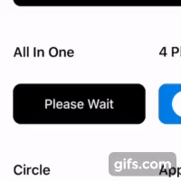

 
[](http://cocoadocs.org/docsets/Whisper)
[](http://cocoadocs.org/docsets/Whisper)
[](http://cocoadocs.org/docsets/Whisper)


# Loady
this is a small library to show loading and indicator in UIButton, with fully customizable styles. there are 6 different  styles, you can set the colors from interface builder or programmatically.


## Todo
- [x] animation style : like appstore download button
- [x] animation style : 4 phases Animation(normal, loading, success, error)
- [x] animation style : like android
- [x] animation style : downloading
- [x] extendable to accept new animations
- [ ] animation style : like telegram sharing
- [ ] Carthage Support


## Installation, cocoapods
**loady minimum target requirement is iOS 10.0**

just add this line into your podfile
```swift
  pod 'loady'
```
or for **manual installation** simply copy the [Source Code](https://github.com/farshadjahanmanesh/loady/tree/master/loady/LoadingButton) into your project, take a look at the example project for more info

## Configs


## Setup programmatically :
```swift

       // sets animation type
        self.loadyButton.setAnimation(LoadyAnimationType.backgroundHighlighter())
        
        // starts loading animation
        self.loadyButton?.startLoading()
        
        // some animations have filling background, or change the circle stroke, this sets the filling percent, number is something between 0 to 100
        loadyButton.update(percent: percent)
```

___

### 4 Phases Animation :
```swift
        // setup colors, titles and images
        self.fourPhases?.loadingColor = UIColor(red:0.38, green:0.66, blue:0.09, alpha:1.0)
        self.fourPhases.loadingColor = UIColor(red:0.38, green:0.66, blue:0.09, alpha:1.0)
			self.fourPhases.setPhases(phases: .init(
				normalPhase:
			(title: "Lock", image: UIImage(named: "unlocked"), background: UIColor(red:0.00, green:0.49, blue:0.90, alpha:1.0)), loadingPhase:
			(title: "Waiting...", image: nil, background: UIColor(red:0.17, green:0.24, blue:0.31, alpha:1.0)),
				successPhase:
			(title: "Activated", image: UIImage(named: "locked"), background: UIColor(red:0.15, green:0.68, blue:0.38, alpha:1.0)), errorPhase:
			(title: "Error", image: UIImage(named: "unlocked"), background: UIColor(red:0.64, green:0.00, blue:0.15, alpha:1.0))
				)
			)
        
        // then later in your code after user click on the button just call, this line take the button to loading phase, 
        self.fourPhasesLoadyButton?.startLoading()

        // in loading phase three different stage is available, you can cancel the loading by calling
        self.fourPhasesLoadyButton?.normalPhase()
        
        // you can take the button to success phase by calling
        self.fourPhasesLoadyButton?.successPhase()
        
        // you can take the button to error phase by calling
        self.fourPhasesLoadyButton?.errorPhase()
        
```

| Loading To Normal | Loading To Success | Loading To Error |
| ------------- | ------------- | ------------- |
|  |  |  |

___
### Downloading Animation :
```swift
// setup download button details
       self.downloadingLoadyButton.setAnimation(LoadyAnimationType.downloading(with: .init(
				downloadingLabel: (title: "Copying Data...", font: UIFont.boldSystemFont(ofSize: 18), textColor : UIColor(red:0, green:0.71, blue:0.8, alpha:1)),
				percentageLabel: (font: UIFont.boldSystemFont(ofSize: 14), textColor : UIColor(red:0, green:0.71, blue:0.8, alpha:1)),
				downloadedLabel: (title: "Completed.", font: UIFont.boldSystemFont(ofSize: 20), textColor : UIColor(red:0, green:0.71, blue:0.8, alpha:1))
				)
			))

```
 

___


## Setup in interface builder
| Set class | change attributes |
| ------------- | ------------- |
|  |  |

___ 

## BONUS - [NVActivityIndicatorView](https://github.com/ninjaprox/NVActivityIndicatorView)

if you are a fan of NVActivityIndicatorView, its very easy to integrate it with loady, you can replace our default iOS indicatorView with NVActivityIndicatorView <3
now we have a new property which accepts LoadyActivityIndicator Protocol, just set it with your favorite activity indicator view like below
```(swift)
// first conform to the LoadyActivityIndicator protocol like this
extension NVActivityIndicatorView : LoadyActivityIndicator {
    
}

// then replace loady default activity indicator with yours
let nv = NVActivityIndicatorView(frame: .zero)
nv.type = .circleStrokeSpin
nv.color = .red
nv.padding = 12
self.loadyButton?.activiyIndicator = nv
```
|  |  |


## troubleshoot 
1. Unable to find a specification for `loady`

if you get some error like this with cocoapod, just update your pod with this commands in your terminal
```
    > [!] Unable to find a specification for `loady`
    
    $ pod repo update
    $ pod install
    
```
